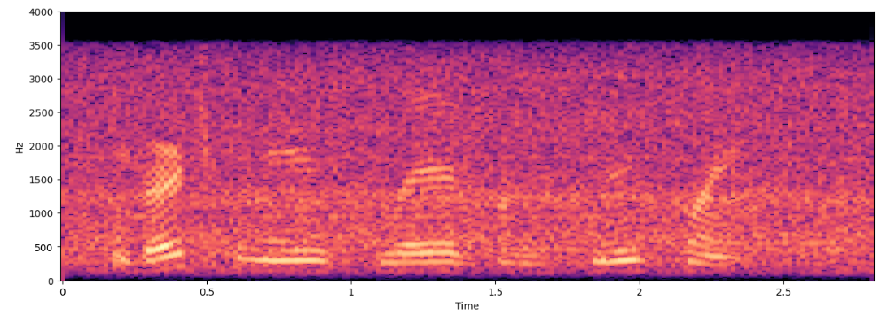
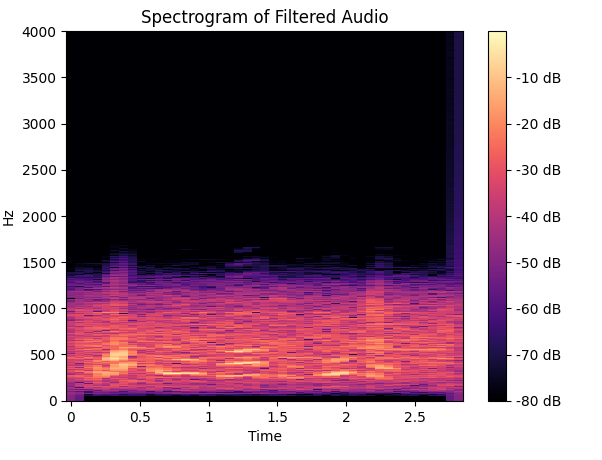
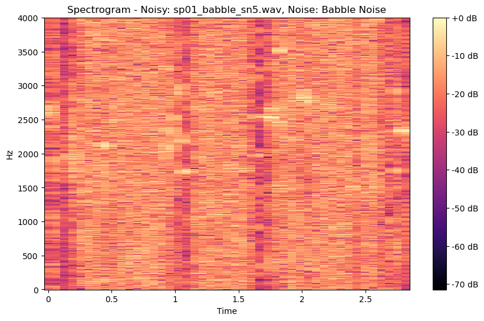

# EnhancedSpeak: Speech Enhancement Techniques with Python

## Overview
EnhancedSpeak is a Python project aimed at improving speech signal quality through filtering and spectral subtraction. This project is ideal for those interested in audio signal processing and noise reduction techniques.

## Features
- **Noise Reduction**: Reduce background noise using low-pass, high-pass, and band-pass filters.
- **Spectral Subtraction**: Enhance speech clarity by subtracting noise components from the speech signal.

## Getting Started

### Prerequisites
Ensure you have Python and pip installed on your machine. This project uses libraries such as `librosa`, `numpy`, and `matplotlib`.

### Installation
Clone the repository and install the required Python packages:
```bash
git clone https://github.com/yourusername/EnhancedSpeak.git
cd EnhancedSpeak
pip install -r requirements.txt
```

### Usage
Run the main script to process the audio files and visualize the spectrograms of the enhanced speech:
```bash
python main.py
```

### Visualizations
Visualize the effects of our speech enhancement techniques through these spectrograms:

Original Audio Spectrogram


Filtered Audio Spectrogram


Spectral Subtracted Audio Spectrogram

